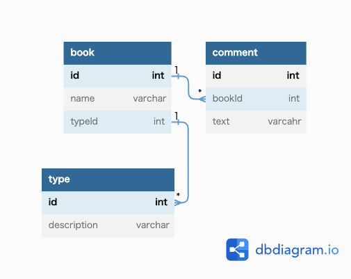

# 課題1
ジャンルが増えた際に、テーブルを追加しなければならない。  
たとえば、「評論」のジャンルが増えた場合、「評論」テーブルを作成し、type=評論を追加する必要がある。  
また「Manga」テーブルと「Novel」テーブルでIdが被った場合を考慮し、常にbelongs_to_idとtypeの2カラムで確認する必要がある。

# 課題2

# 課題3
youtubeのような動画配信サービスにおいて  
「動画」と「ライブ動画」を別テーブルで作成して、  
それに対するコメント欄を「コメント」テーブルで管理した場合。  
