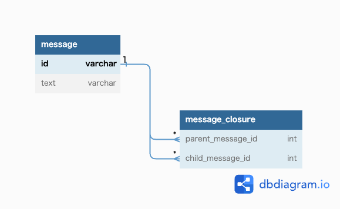

# 課題1
親子の関係がどのくらいの階層に渡って発生しているのかが分からないため、  
再帰クエリが定義されているベンダーでないとデータの抽出ロジックが複雑になるか  
あるいは、アプリ側とDB側の通信が何度にも渡って発生するようになり、通信によるオーバーヘッドが増える。

# 課題2

# 課題3
植物の分類を管理するサービス
植物の下に、種子植物 と 胞子植物
種子植物の下に、被子植物 と 裸子植物
胞子植物の下に、シダ植物 と コケ植物 とソウ類
といった具合に階層構造で分類する場合。