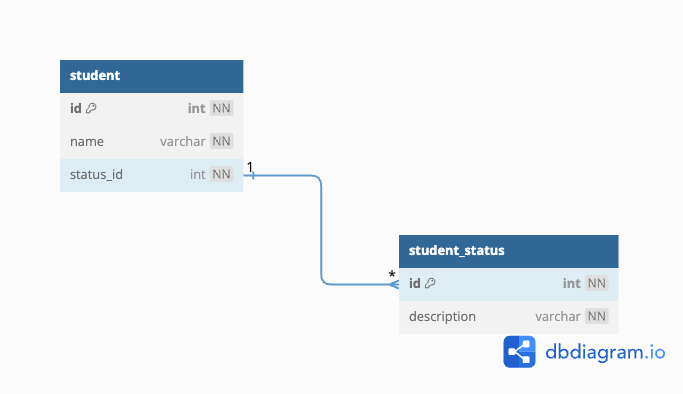

# 課題1
boolean型で定義すると、"退会"か"退会以外"の2つの状態しか管理できない。  
たとえば"退会予定"といった状態を管理したいと要望が発生した際にテーブル定義を変更する必要がでてくる。  

# 課題2

# 課題3
## 課題3-1-1
どの程度"注文取消"が発生していることがわからないため、  
販売機会を損失しているという仮説を検証することできない。  
## 課題3-1-2
過去会員の情報が取得できないため、退会した人の特徴分析が行えない。  
例えば、退会する人の8割が1ヶ月でやめているのであれば、入会してから1ヶ月の間の入会者に対して、  
何かしらのアプローチを行うといった対策を立てられる。
## 課題3-2-1
投資信託ファンド情報が変更された場合にファンド情報を物理削除し、変更後の情報を再登録していた。  
ファンド情報の変更はほとんど発生しないし、また変更前の情報はそこまで有用ではなかったため、  
削除しても問題なかった。